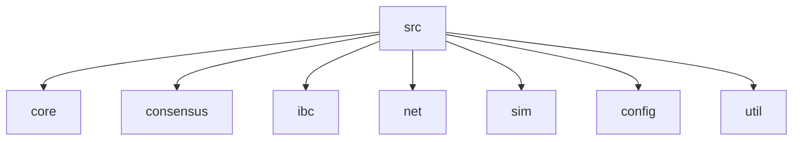

# Blockchain-Comm-Sim

**A High-Fidelity Blockchain Network & IBC Simulation Framework**

`Blockchain-Comm-Sim` is a C++20 discrete-event simulation tool designed to model the complexities of multi-chain networks and Inter-Blockchain Communication (IBC). It simulates network latency, packet drops, consensus partitions, and cross-chain relaying to facilitate research into distributed consensus and interoperability protocols.

## 🚀 Key Features

*   **Multi-Consensus Support**:
    *   **PoW (Proof of Work)**: Simulates difficulty and mining delays.
    *   **PoS (Proof of Stake)**: Simulates validator sets and voting power.
    *   **PBFT (Practical Byzantine Fault Tolerance)**: Simulates multi-phase commit steps (PrePrepare, Prepare, Commit).
*   **Network Simulation**:
    *   Configurable link latency.
    *   Probabilistic packet dropping and network partitioning.
*   **IBC (Inter-Blockchain Communication)**:
    *   Simulated Relayers (off-chain processes).
    *   Packet lifecycle simulation (Send -> Recv -> Ack).
*   **Architecture**:
    *   Modular design: specific components for Consensus, Network, and Core logic.
    *   Thread-per-node model for realistic concurrency simulation.

## 🛠️ Project Status

> **Note**: This project is currently in the **Research/Prototype** phase.

Current limitations (per `info` roadmap):
*   **Configuration**: Simulation topology is currently hardcoded in `src/main.cpp`. A JSON based configuration system (`config.txt`) is designed but not yet wired up.
*   **Metrics**: Instrumentation interfaces exist (`Metrics.h`) but data collection sinks are not yet fully implemented.
*   **Relayer**: Basic scaffolding is present; full event-driven relaying logic is in development.

## 📦 Directory Structure

The codebase is organized into modular components under the `src/` directory:



### Detailed Breakdown

*   **`src/core/`**: Fundamental primitives.
    *   `Block.h`, `Transaction.h`: Data structures for the ledger.
    *   `Node.h`: Represents a full blockchain node (network + consensus + state).
    *   `Blockchain.h`: Chain state management.
*   **`src/consensus/`**: Pluggable consensus engines.
    *   `PoW`: Nakamoto consensus simulation.
    *   `PoS`: Validator-based consensus.
    *   `PBFT`: Classical BFT consensus.
*   **`src/ibc/`**: Interoperability layer.
    *   `Relayer.h`: Off-chain process that queries chains and relays packets.
    *   `IBCChannel`: On-chain channel abstractions.
*   **`src/net/`**: Networking layer.
    *   `Transport.h`: Simulates the physical network layer (delays, drops).
*   **`src/sim/`**: Simulation orchestration.
    *   `SimulationController.h`: Main driver that sets up the topology and runs the scenario.
*   **`src/config/`**: Configuration structures (`ChainConfig`, `SimulationConfig`).
*   **`src/util/`**: Helpers for logging, error handling, and metrics.

## 🔧 Build & Run

### Prerequisites
*   **C++ Compiler**: Must support **C++20** (e.g., GCC 10+, Clang 10+, MSVC 2019+).
*   **CMake**: Version 3.16 or higher.

### Building the Project

```bash
# 1. Create a build directory
mkdir build
cd build

# 2. Configure with CMake
cmake ..

# 3. Compile
make -j$(nproc)
```

### Running the Simulation

```bash
./ibc-sim
```
*Press `Ctrl+C` to stop the simulation gracefully.*

## 🛣️ Roadmap

1.  **Metrics Implementation**: Implement `MetricsSink` to export data (throughput, latency) to CSV or Prometheus.
2.  **Full Relayer Logic**: Implement the event loop in `Relayer.cpp` to listen for events and forward IBC packets.
3.  **Traffic Injection**: Implement `injectTraffic()` to generate realistic cross-chain transaction loads.
4.  **JSON Configuration**: Hook up `config.txt` to replace hardcoded setup in `main.cpp`.

## 📄 License

This project is licensed under the MIT License - see the [LICENSE](LICENSE) file for details.
